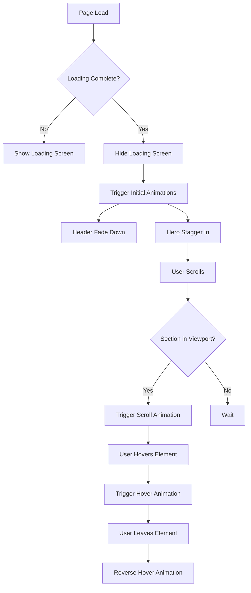
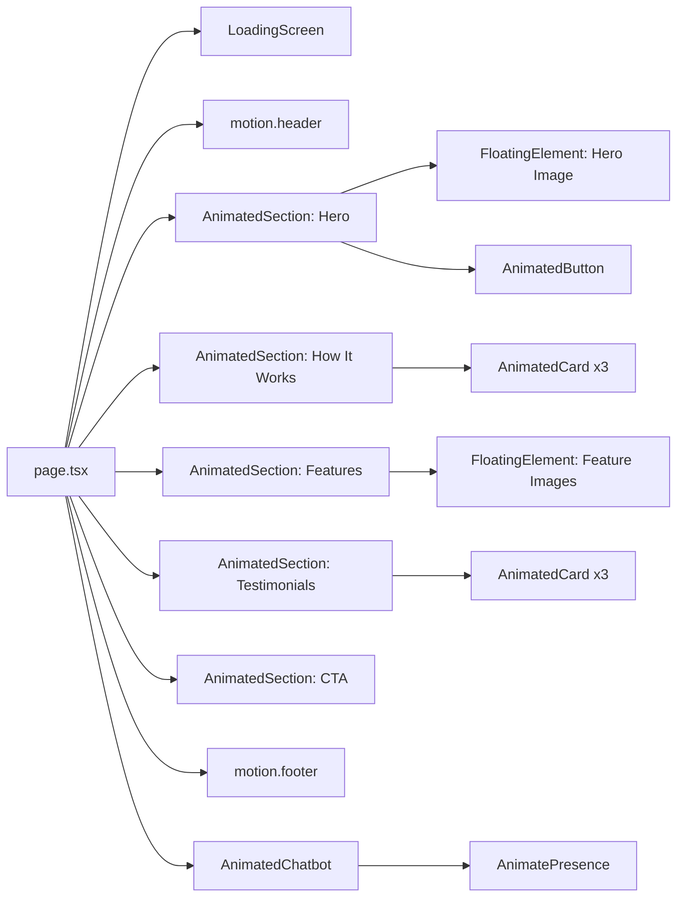
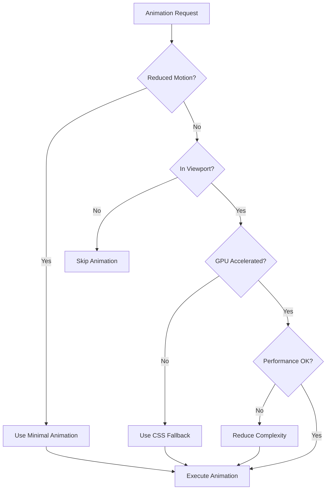

# Design Document

## Overview

This design document outlines the implementation strategy for adding smooth, modern animations and micro-interactions to the HisaabScore landing page using Framer Motion. The solution will enhance user engagement through scroll-based animations, hover interactions, entrance animations, and loading states while maintaining performance, accessibility, and layout stability.

The implementation will leverage Framer Motion's declarative API, which integrates seamlessly with React and Next.js, providing GPU-accelerated animations with built-in accessibility features like `prefers-reduced-motion` support.

## Architecture

### High-Level Architecture

```
Landing Page (page.tsx)
├── Animation Provider (Framer Motion)
├── Loading Screen Component
├── Animated Header
├── Animated Hero Section
├── Scroll-Animated Sections
│   ├── How It Works
│   ├── Features
│   ├── Testimonials
│   └── CTA
├── Animated Footer
└── Animated Chatbot Widget
```

### Animation Strategy

1. **Initial Load Animations**: Triggered on component mount using `initial` and `animate` props
2. **Scroll-Based Animations**: Triggered using `IntersectionObserver` via Framer Motion's `whileInView` prop
3. **Hover Interactions**: Applied using `whileHover` and `whileTap` props
4. **State Transitions**: Managed using `AnimatePresence` for enter/exit animations
5. **Performance Optimization**: Use `layoutId` for shared element transitions and `will-change` CSS hints

### Technology Stack

- **Framer Motion** (v11.x): Primary animation library
- **React 18**: Component framework
- **Next.js 15**: Application framework with App Router
- **TypeScript**: Type safety for animation configurations
- **Tailwind CSS**: Styling with animation utilities

## Components and Interfaces

### 1. Animation Configuration Module

**File**: `src/lib/animations.ts`

```typescript
// Animation variants for reusability
export const fadeInUp = {
  initial: { opacity: 0, y: 20 },
  animate: { opacity: 1, y: 0 },
  exit: { opacity: 0, y: -20 },
};

export const fadeInDown = {
  initial: { opacity: 0, y: -20 },
  animate: { opacity: 1, y: 0 },
};

export const scaleIn = {
  initial: { opacity: 0, scale: 0.9 },
  animate: { opacity: 1, scale: 1 },
};

export const slideInLeft = {
  initial: { opacity: 0, x: -50 },
  animate: { opacity: 1, x: 0 },
};

export const slideInRight = {
  initial: { opacity: 0, x: 50 },
  animate: { opacity: 1, x: 0 },
};

// Transition configurations
export const springTransition = {
  type: "spring",
  stiffness: 100,
  damping: 15,
};

export const smoothTransition = {
  duration: 0.3,
  ease: "easeOut",
};

// Stagger configurations
export const staggerContainer = {
  animate: {
    transition: {
      staggerChildren: 0.1,
    },
  },
};
```

### 2. Loading Screen Component

**File**: `src/components/loading-screen.tsx`

```typescript
interface LoadingScreenProps {
  isLoading: boolean;
}

// Features:
// - Full-screen overlay with backdrop blur
// - Animated logo or spinner
// - Fade in/out transitions
// - Auto-hide after page load
```

### 3. Animated Wrapper Components

**File**: `src/components/animated/index.tsx`

```typescript
// AnimatedSection: Wrapper for scroll-triggered animations
interface AnimatedSectionProps {
  children: React.ReactNode;
  variant?: "fadeInUp" | "fadeIn" | "scaleIn";
  delay?: number;
  once?: boolean;
}

// AnimatedCard: Wrapper for card components with hover effects
interface AnimatedCardProps {
  children: React.ReactNode;
  hoverScale?: number;
  className?: string;
}

// AnimatedButton: Enhanced button with micro-interactions
interface AnimatedButtonProps extends ButtonProps {
  hoverScale?: number;
  tapScale?: number;
}
```

### 4. Parallax Background Component

**File**: `src/components/parallax-background.tsx`

```typescript
interface ParallaxBackgroundProps {
  children: React.ReactNode;
  speed?: number; // 0-1, where 0.5 is half scroll speed
}

// Uses useScroll and useTransform from Framer Motion
// Respects prefers-reduced-motion
```

### 5. Floating Animation Component

**File**: `src/components/floating-element.tsx`

```typescript
interface FloatingElementProps {
  children: React.ReactNode;
  duration?: number;
  yOffset?: number;
}

// Continuous floating animation using keyframes
// Respects prefers-reduced-motion
```

## Data Models

### Animation Configuration Type

```typescript
interface AnimationConfig {
  initial: Record<string, any>;
  animate: Record<string, any>;
  exit?: Record<string, any>;
  transition?: {
    duration?: number;
    delay?: number;
    ease?: string | number[];
    type?: "spring" | "tween" | "inertia";
    stiffness?: number;
    damping?: number;
  };
}

interface ScrollAnimationConfig extends AnimationConfig {
  once?: boolean;
  amount?: number | "some" | "all"; // Intersection threshold
  margin?: string; // Intersection margin
}
```

### Motion Preferences Hook

```typescript
interface MotionPreferences {
  prefersReducedMotion: boolean;
  shouldAnimate: boolean;
}

// Custom hook to check user preferences
function useMotionPreferences(): MotionPreferences;
```

## Implementation Details

### Page Structure Modifications

The landing page will be refactored to use Framer Motion components:

1. **Replace `div` with `motion.div`** for animated sections
2. **Wrap sections** with `AnimatedSection` components
3. **Replace buttons** with `AnimatedButton` components
4. **Wrap cards** with `AnimatedCard` components
5. **Add `LoadingScreen`** at the root level

### Specific Section Animations

#### Header/Navigation

- Initial: Fade down from top on page load
- Sticky behavior: Maintain smooth transitions
- Links: Color transition on hover (200ms)
- Buttons: Scale to 105% on hover

#### Hero Section

- Badge: Fade in + scale (delay: 0ms)
- Heading: Fade in + slide up (delay: 100ms)
- Description: Fade in + slide up (delay: 200ms)
- Buttons: Fade in + slide up (delay: 300ms)
- Stats: Fade in + scale (delay: 400ms, stagger: 100ms)
- Hero Image: Floating animation (3s cycle) + parallax on scroll

#### How It Works Section

- Section Header: Fade in + slide up when in viewport
- Cards: Staggered fade in + slide up (100ms stagger)
- Step Numbers: Scale in with bounce effect
- Icons: Rotate + scale on hover

#### Features Section

- Alternating slide animations (left/right based on layout)
- Images: Floating animation + scale pulse
- Checkmarks: Staggered fade in
- Icon containers: Glow effect on hover

#### Testimonials Section

- Cards: Staggered scale in animation
- Avatar: Scale + rotate on hover
- Card: Lift + shadow glow on hover

#### CTA Section

- Heading: Scale in + fade
- Description: Slide up with delay
- Button: Pulse animation + enhanced hover effect

#### Footer

- Fade in when in viewport
- Social icons: Rotate + scale on hover
- Links: Color transition on hover

#### Chatbot Widget

- Button: Scale + rotate on hover, pulse animation
- Chat Window: Scale + fade in/out
- Messages: Slide in from appropriate side
- Typing Indicator: Bounce animation
- Suggested Questions: Staggered fade in

### Performance Optimizations

1. **GPU Acceleration**: Use `transform` and `opacity` properties only
2. **Lazy Animation**: Defer non-critical animations using `viewport` prop
3. **Animation Throttling**: Limit concurrent animations
4. **Reduced Motion**: Respect `prefers-reduced-motion` media query
5. **Layout Stability**: Use `layout` prop sparingly, prefer `layoutId` for shared elements
6. **Code Splitting**: Lazy load Framer Motion for non-critical animations

### Accessibility Considerations

1. **Reduced Motion Support**:

   ```typescript
   const shouldReduceMotion = useReducedMotion();
   const transition = shouldReduceMotion
     ? { duration: 0.01 }
     : { duration: 0.3 };
   ```

2. **Keyboard Navigation**: Ensure focus states are visible during animations
3. **Screen Readers**: Animations should not interfere with ARIA labels
4. **Focus Management**: Maintain focus during state transitions

## Error Handling

### Animation Fallbacks

1. **Browser Compatibility**: Provide CSS fallbacks for older browsers
2. **Performance Issues**: Disable complex animations on low-end devices
3. **Failed Imports**: Gracefully degrade if Framer Motion fails to load
4. **Intersection Observer**: Fallback to immediate display if not supported

### Error Boundaries

Wrap animated components in error boundaries to prevent animation errors from breaking the page:

```typescript
<ErrorBoundary fallback={<StaticComponent />}>
  <AnimatedComponent />
</ErrorBoundary>
```

## Testing Strategy

### Unit Tests

1. Test animation variant configurations
2. Test motion preference hooks
3. Test component prop handling
4. Test accessibility features

### Integration Tests

1. Test scroll-triggered animations
2. Test hover interactions
3. Test loading screen behavior
4. Test chatbot animations
5. Test reduced motion preferences

### Visual Regression Tests

1. Capture screenshots at different animation states
2. Test on multiple viewport sizes
3. Test with reduced motion enabled
4. Test animation timing and sequencing

### Performance Tests

1. Measure frame rate during animations (target: 60fps)
2. Measure Cumulative Layout Shift (CLS) (target: <0.1)
3. Measure Time to Interactive (TTI)
4. Test on low-end devices

### Manual Testing Checklist

- [ ] All entrance animations play smoothly on page load
- [ ] Scroll animations trigger at appropriate viewport positions
- [ ] Hover effects work on all interactive elements
- [ ] Chatbot animations are smooth and responsive
- [ ] Loading screen appears and disappears correctly
- [ ] Reduced motion preferences are respected
- [ ] No layout shifts occur during animations
- [ ] Animations work on mobile devices
- [ ] Keyboard navigation is not affected
- [ ] Page performance remains optimal

## Implementation Phases

### Phase 1: Setup and Infrastructure

- Install Framer Motion
- Create animation configuration module
- Create reusable animated components
- Set up motion preferences hook

### Phase 2: Core Animations

- Implement loading screen
- Add header animations
- Add hero section animations
- Add scroll-based section animations

### Phase 3: Micro-interactions

- Add button hover effects
- Add card hover effects
- Add icon animations
- Add link transitions

### Phase 4: Advanced Effects

- Implement parallax backgrounds
- Add floating animations
- Enhance chatbot animations
- Add CTA pulse effects

### Phase 5: Optimization and Testing

- Implement reduced motion support
- Optimize performance
- Add error boundaries
- Conduct testing
- Fix issues and refine animations

## Design Decisions and Rationales

### Why Framer Motion?

1. **Declarative API**: Easy to understand and maintain
2. **Performance**: GPU-accelerated by default
3. **Accessibility**: Built-in reduced motion support
4. **React Integration**: First-class React support
5. **Bundle Size**: Tree-shakeable, only ~30KB gzipped
6. **TypeScript Support**: Excellent type definitions

### Animation Timing Choices

- **200-300ms**: Standard for micro-interactions (feels instant)
- **400-600ms**: For entrance animations (noticeable but not slow)
- **3-4s**: For continuous animations (subtle, not distracting)
- **100ms stagger**: Creates smooth sequential effect

### Motion Reduction Strategy

Rather than completely disabling animations, we reduce them:

- Shorten durations to <50ms
- Remove scale and rotation effects
- Keep opacity transitions for visual feedback
- Disable parallax and floating effects

This maintains visual feedback while respecting user preferences.

## Mermaid Diagrams

### Animation Flow



### Component Hierarchy



### Performance Optimization Flow



## Conclusion

This design provides a comprehensive approach to implementing smooth, modern animations across the HisaabScore landing page. By leveraging Framer Motion's powerful features and following best practices for performance and accessibility, we will create an engaging, polished user experience that enhances the brand's premium positioning while maintaining excellent performance metrics and accessibility standards.
